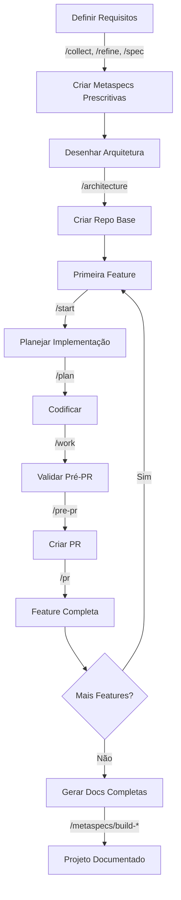
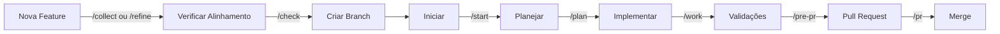

# Como Começar com o Framework Product On Rails

Este guia fornece respostas detalhadas às perguntas mais comuns sobre como iniciar e usar o framework de desenvolvimento orientado por IA.

## Índice

1. [Como Iniciar um Projeto do Zero](#1-como-iniciar-um-projeto-do-zero)
2. [Quando Gerar Meta Specs](#2-quando-gerar-meta-specs)
3. [Como Gerar Arquivos de Documentação](#3-como-gerar-arquivos-de-documentação)
4. [Fluxo Completo Recomendado](#4-fluxo-completo-recomendado)
5. [Exemplos Práticos](#5-exemplos-práticos)

---

## 1. Como Iniciar um Projeto do Zero

O framework oferece **dois fluxos principais** que podem ser combinados dependendo do seu cenário.

### Opção A: Fluxo Produto-Primeiro (Recomendado)

Use este fluxo quando estiver iniciando um projeto completamente novo e quiser documentar bem os requisitos antes de codificar.

```bash
# Passo 1: Coletar o requirement inicial
/collect

# Passo 2: Refinar o requirement (WHY/WHAT/HOW)
/refine

# Passo 3: Criar especificação detalhada (PRD)
/spec

# Passo 4: Desenhar arquitetura conceitual
/architecture

# Passo 5: Criar repositório e estrutura básica (manual)
# - Inicializar git
# - Criar estrutura de pastas
# - Configurar dependências básicas

# Passo 6: Iniciar desenvolvimento na primeira branch
/start

# Passo 7: Quebrar implementação em fases
/plan

# Passo 8: Implementar fase por fase
/work
```

**Quando usar:**
- Projeto totalmente novo sem código
- Requisitos complexos que precisam de refinamento
- Time de produto envolvido desde o início
- Precisa validar arquitetura antes de codificar

### Opção B: Direto para Código

Use este fluxo quando já souber exatamente o que implementar e quiser começar rapidamente.

```bash
# Passo 1: Criar repositório e estrutura inicial (manual)
git init
# Setup básico da stack escolhida

# Passo 2: Criar arquivo de requirements
# Exemplo: .claude/sessions/feature-login/requirements.md

# Passo 3: Iniciar desenvolvimento
/start .claude/sessions/feature-login/requirements.md

# Passo 4: Quebrar implementação
/plan

# Passo 5: Codificar
/work
```

**Quando usar:**
- Projeto simples e bem definido
- Urgência para começar a codificar
- Requisitos já conhecidos
- Prova de conceito ou MVP

### Opção C: Projeto Existente (Adicionar Features)

Se você já tem um projeto em andamento e quer adicionar uma nova feature:

```bash
# Passo 1: Criar branch
git checkout -b feature/nova-funcionalidade

# Passo 2: Documentar requirement (escolha um)
/collect  # Rápido
/refine   # Médio
/spec     # Detalhado

# Passo 3: Verificar alinhamento com metaspecs
/check

# Passo 4: Iniciar desenvolvimento
/start

# Passo 5: Planejar
/plan

# Passo 6: Implementar
/work

# Passo 7: Pré-PR (validações)
/pre-pr

# Passo 8: Criar Pull Request
/pr
```

---

## 2. Quando Gerar Meta Specs

As meta specs podem ser criadas **ANTES** ou **DEPOIS** do código. Ambas as abordagens têm valor e podem ser combinadas.

### Abordagem Prescritiva (ANTES do Código)

Criar metaspecs manualmente para servir como **guia** para os agentes de IA.

**O que documentar:**

```
metaspecs/
├── technical/
│   ├── architecture.md       # Padrões arquiteturais obrigatórios
│   ├── coding-standards.md   # Convenções de código
│   ├── stack.md              # Tecnologias aprovadas
│   └── security.md           # Políticas de segurança
└── business/
    ├── domain-model.md       # Conceitos de domínio
    ├── core-rules.md         # Regras de negócio fundamentais
    └── glossary.md           # Terminologia do negócio
```

**Exemplo de metaspec prescritiva:**

```markdown
# metaspecs/technical/architecture.md

## Princípios Arquiteturais

### 1. Separação de Responsabilidades
- Usar Clean Architecture com camadas bem definidas
- Controllers apenas roteiam, não contêm lógica de negócio
- Services contêm toda a lógica de negócio
- Repositories abstraem acesso a dados

### 2. Testes Obrigatórios
- Toda feature DEVE ter testes unitários
- APIs DEVEM ter testes de integração
- Cobertura mínima: 80%

### 3. Tratamento de Erros
- Sempre usar classes de erro customizadas
- Nunca expor stack traces ao cliente
- Logar erros com contexto adequado
```

**Benefícios:**
- ✅ Agentes seguem padrões desde o início
- ✅ Consistência arquitetural garantida
- ✅ Facilita code review
- ✅ Onboarding de desenvolvedores mais rápido

**Quando criar:**
- Início de projeto novo
- Definição de arquitetura
- Estabelecimento de padrões de time
- Antes de escalar o time

### Abordagem Descritiva (DEPOIS do Código)

Gerar metaspecs automaticamente a partir do código existente.

```bash
# Para projeto único
/metaspecs/build-tech-docs      # Gera documentação técnica
/metaspecs/build-business-docs  # Gera documentação de negócio
/metaspecs/build-index          # Atualiza índice

# Para multi-repositório (execute em cada repo)
/repodocs/generate-docs         # Gera docs/ completo
```

**Benefícios:**
- ✅ Documentação sempre reflete a realidade
- ✅ Automatização reduz trabalho manual
- ✅ Útil para projetos legacy sem documentação
- ✅ Facilita manutenção de documentação

**Quando gerar:**
- Após implementação de features
- Documentação de código legacy
- Preparação para novos membros no time
- Auditorias de código

### Abordagem Híbrida (Recomendada) 🎯

Combine o melhor dos dois mundos:

```
INÍCIO DO PROJETO
│
├─ Criar metaspecs prescritivas básicas
│  ├─ Arquitetura desejada
│  ├─ Stack tecnológica
│  ├─ Princípios de design
│  └─ Regras de negócio core
│
DURANTE DESENVOLVIMENTO
│
├─ Enriquecer com /spec e /architecture
│  └─ Cada feature adiciona contexto
│
APÓS IMPLEMENTAÇÃO
│
├─ Gerar documentação completa
│  ├─ /metaspecs/build-tech-docs
│  ├─ /metaspecs/build-business-docs
│  └─ /metaspecs/build-index
│
MANUTENÇÃO CONTÍNUA
│
└─ Atualizar metaspecs quando:
   ├─ Arquitetura mudar
   ├─ Novos padrões forem adotados
   ├─ Regras de negócio evoluírem
   └─ Stack for atualizada
```

---

## 3. Como Gerar Arquivos de Documentação

A geração de documentação depende da estrutura do seu projeto.

### Cenário 1: Projeto Único (Monolito)

Para projetos com um único repositório:

```bash
# 1. Gerar documentação técnica
/metaspecs/build-tech-docs
# Cria: metaspecs/technical/*.md

# 2. Gerar documentação de negócio
/metaspecs/build-business-docs
# Cria: metaspecs/business/*.md

# 3. Atualizar índice geral
/metaspecs/build-index
# Atualiza: metaspecs/index.md
```

**Estrutura gerada:**

```
metaspecs/
├── technical/
│   ├── architecture.md
│   ├── stack.md
│   ├── patterns.md
│   └── apis.md
├── business/
│   ├── domain-model.md
│   ├── business-rules.md
│   └── workflows.md
└── index.md
```

### Cenário 2: Multi-Repositório (Microserviços)

Para projetos com múltiplos repositórios:

#### Passo 1: Gerar Documentação em Cada Repositório

Execute em **cada repositório** do seu projeto:

```bash
cd ~/projetos/payment-api
/repodocs/generate-docs

cd ~/projetos/user-service
/repodocs/generate-docs

cd ~/projetos/notification-service
/repodocs/generate-docs
```

**O que acontece:**

1. **Análise Automática**
   - Escaneia estrutura de diretórios
   - Identifica stack tecnológica (package.json, requirements.txt, etc.)
   - Detecta padrões arquiteturais (MVC, Clean Architecture, etc.)
   - Mapeia funcionalidades e endpoints
   - Identifica integrações com outros serviços

2. **Perguntas Interativas** (8-12 perguntas adaptadas ao tipo de repo)
   - Propósito e contexto do repositório
   - Funcionalidades críticas
   - Regras de negócio complexas
   - Integrações com outros serviços
   - Padrões e boas práticas

3. **Geração de Documentação na pasta `docs/`**

```
payment-api/
├── docs/
│   ├── index.md              # Índice geral
│   ├── stack.md              # Stack tecnológica
│   ├── patterns.md           # Padrões de design
│   ├── features.md           # Funcionalidades
│   ├── business-rules.md     # Regras de negócio
│   ├── integrations.md       # Integrações
│   ├── apis.md              # Endpoints (se for API)
│   └── services.md          # Microserviço (se aplicável)
```

**Exemplo de conteúdo gerado (docs/stack.md):**

```markdown
# Stack Tecnológica - Payment API

## Linguagens e Runtime
- Node.js 20.x
- TypeScript 5.3

## Frameworks Principais
- Express 4.18 - Framework web
- Prisma 5.x - ORM para PostgreSQL

## Bibliotecas Chave
- Stripe SDK - Processamento de pagamentos
- Bull - Filas de processamento
- Winston - Logging estruturado

## Banco de Dados
- PostgreSQL 15 - Banco principal
- Redis 7 - Cache e filas

## Infraestrutura
- Docker para containerização
- AWS ECS para deploy
- AWS RDS para PostgreSQL

## Arquitetura Geral
Clean Architecture com 4 camadas:
- Controllers (rotas HTTP)
- Use Cases (lógica de negócio)
- Repositories (acesso a dados)
- Entities (domínio)
```

#### Passo 2: Consolidar Resumos nas Metaspecs

No repositório/pasta de **metaspecs centralizadas**:

```bash
# Consolidar cada repositório
/metaspecs/build-repo-summary ~/projetos/payment-api
/metaspecs/build-repo-summary ~/projetos/user-service
/metaspecs/build-repo-summary ~/projetos/notification-service

# Organizar em subpastas (opcional)
/metaspecs/build-repo-summary ~/projetos/payment-api apis/payment.md
/metaspecs/build-repo-summary ~/projetos/user-service services/user.md
/metaspecs/build-repo-summary ~/projetos/notification-service services/notification.md
```

**O que este comando faz:**

1. Lê a documentação da pasta `docs/` do repositório
2. Cria um **resumo executivo** otimizado para IA contendo:
   - **Propósito e papel** no ecossistema
   - **Top 5-7 funcionalidades** principais
   - **Stack básica** (linguagem, framework, BD)
   - **Relações** com outros repositórios

**Exemplo de resumo gerado (technical/apis/payment.md):**

```markdown
# Payment API

## Propósito
API responsável por processar pagamentos, gerenciar métodos de pagamento e manter histórico de transações. Integra com gateway Stripe e notifica outros serviços sobre status de pagamentos.

## Funcionalidades Principais
1. Processar pagamentos com cartão de crédito via Stripe
2. Gerenciar métodos de pagamento salvos dos usuários
3. Processar reembolsos e estornos
4. Gerar relatórios de transações
5. Webhook para notificações do Stripe
6. Retry automático para pagamentos falhos
7. Validação PCI-compliant de dados de cartão

## Stack Básica
- **Linguagem**: TypeScript (Node.js 20)
- **Framework**: Express + Clean Architecture
- **Banco de Dados**: PostgreSQL 15 + Redis
- **Integrações**: Stripe SDK, Bull queues

## Relações com Outros Repositórios
- **user-service**: Consome API para validar usuários
- **notification-service**: Publica eventos de pagamento via RabbitMQ
- **order-service**: Recebe callbacks sobre status de pagamento
- **admin-dashboard**: Fornece endpoints de relatórios

## Documentação Completa
Ver: `~/projetos/payment-api/docs/`
```

#### Passo 3: Atualizar Índice Geral

```bash
/metaspecs/build-index
```

**Estrutura final das metaspecs:**

```
metaspecs/
├── technical/
│   ├── core/
│   │   ├── main-app.md
│   │   └── shared-lib.md
│   ├── apis/
│   │   ├── payment.md
│   │   ├── user.md
│   │   └── notification.md
│   └── services/
│       ├── auth-service.md
│       └── analytics-service.md
├── business/
│   ├── domain-model.md
│   └── workflows.md
└── index.md                    # Índice atualizado
```

### Quando Usar Cada Abordagem?

| Critério | Projeto Único | Multi-Repositório |
|----------|---------------|-------------------|
| **Número de repos** | 1 | 2+ |
| **Arquitetura** | Monolito | Microserviços/Distribuída |
| **Complexidade** | Baixa-Média | Média-Alta |
| **Time** | Pequeno | Múltiplas equipes |
| **Comando principal** | `/metaspecs/build-*` | `/repodocs/generate-docs` |

---

## 4. Fluxo Completo Recomendado

### Para Novo Projeto



### Para Projeto Existente (Adicionar Feature)



### Para Documentar Projeto Legacy

```mermaid
graph TD
    A[Projeto Legacy] --> B{Múltiplos Repos?}
    B -->|Não| C[/metaspecs/build-tech-docs]
    B -->|Sim| D[Para Cada Repo]
    D --> E[/repodocs/generate-docs]
    E --> F[/metaspecs/build-repo-summary]
    C --> G[/metaspecs/build-index]
    F --> G
    G --> H[Documentação Completa]
```

---

## 5. Exemplos Práticos

### Exemplo 1: E-commerce do Zero

**Contexto:** Criar uma plataforma de e-commerce completa.

```bash
# 1. PRODUTO: Definir o que construir
/collect
# Responder: "Plataforma de e-commerce B2C com catálogo, carrinho e checkout"

/refine
# Sistema refinará WHY/WHAT/HOW

/spec
# Criar PRD detalhado

/architecture
# Desenhar arquitetura: monolito ou microserviços?

# 2. METASPECS PRESCRITIVAS
# Criar manualmente:
# - metaspecs/technical/architecture.md (Clean Architecture)
# - metaspecs/technical/stack.md (Node.js, React, PostgreSQL)
# - metaspecs/business/domain-model.md (Product, Cart, Order, Payment)

# 3. PRIMEIRA FEATURE: Catálogo de Produtos
git checkout -b feature/product-catalog

/start
# AI criará .claude/sessions/feature-product-catalog/
# - context.md
# - architecture.md

/plan
# AI quebrará em fases:
# - Fase 1: Modelo de dados
# - Fase 2: Repository layer
# - Fase 3: Service layer
# - Fase 4: API endpoints
# - Fase 5: Testes

/work
# AI implementará fase por fase, pedindo aprovação

# Fazer commit após cada fase
git add .
git commit -m "feat: implement product catalog - phase 1 (data model)"

# 4. PRÉ-PR
/pre-pr
# Executará 4 agentes:
# - Verifica alinhamento com metaspecs
# - Code review
# - Atualiza documentação
# - Sugere testes

# 5. PULL REQUEST
/pr
# Criará PR com descrição automática

# 6. PRÓXIMA FEATURE: Shopping Cart
git checkout main
git pull
git checkout -b feature/shopping-cart

/refine
# Documentar requisitos do carrinho

/check
# Verificar se bate com metaspecs

/start
/plan
/work
/pre-pr
/pr
```

### Exemplo 2: Sistema de Microserviços

**Contexto:** Sistema com 3 microserviços já implementados, precisa documentar.

```bash
# REPOSITÓRIO 1: user-service
cd ~/projetos/user-service
/repodocs/generate-docs
# AI perguntará sobre funcionalidades, integrações, etc.
# Gerará docs/ completo

# REPOSITÓRIO 2: payment-service
cd ~/projetos/payment-service
/repodocs/generate-docs

# REPOSITÓRIO 3: notification-service
cd ~/projetos/notification-service
/repodocs/generate-docs

# CONSOLIDAÇÃO: Metaspecs centralizadas
cd ~/projetos/metaspecs

/metaspecs/build-repo-summary ~/projetos/user-service services/user.md
/metaspecs/build-repo-summary ~/projetos/payment-service services/payment.md
/metaspecs/build-repo-summary ~/projetos/notification-service services/notification.md

/metaspecs/build-index

# Resultado:
# metaspecs/
# ├── technical/
# │   └── services/
# │       ├── user.md
# │       ├── payment.md
# │       └── notification.md
# └── index.md
```

### Exemplo 3: Adicionar Feature em Projeto Existente

**Contexto:** Adicionar autenticação via OAuth no projeto.

```bash
# 1. Criar branch
git checkout -b feature/oauth-authentication

# 2. Documentar requirement
/refine
# Responder perguntas sobre:
# - Provedores OAuth (Google, GitHub, etc.)
# - Fluxo de autenticação
# - Armazenamento de tokens

# 3. Verificar alinhamento
/check
# AI verificará se OAuth está alinhado com metaspecs de segurança

# 4. Iniciar desenvolvimento
/start
# AI criará:
# - .claude/sessions/feature-oauth-authentication/context.md
# - .claude/sessions/feature-oauth-authentication/architecture.md

# 5. Planejar
/plan
# AI quebrará em:
# - Fase 1: Configurar OAuth providers
# - Fase 2: Criar endpoints de callback
# - Fase 3: Integrar com sistema de autenticação existente
# - Fase 4: Testes de integração

# 6. Implementar
/work
# Codificar fase por fase

# Commits incrementais
git add .
git commit -m "feat(auth): add OAuth providers configuration"

git add .
git commit -m "feat(auth): implement OAuth callback endpoints"

# 7. Pré-PR
/pre-pr
# - Verifica metaspecs de segurança
# - Code review focado em autenticação
# - Sugere testes de segurança

# 8. PR
/pr
```

### Exemplo 4: Documentar Projeto Legacy

**Contexto:** Projeto de 2 anos sem documentação adequada.

```bash
# 1. Gerar documentação técnica
/metaspecs/build-tech-docs
# AI analisará código e criará metaspecs/technical/

# 2. Gerar documentação de negócio
/metaspecs/build-business-docs
# AI extrairá regras de negócio do código

# 3. Atualizar índice
/metaspecs/build-index

# 4. Revisar e ajustar manualmente
# Abrir metaspecs/index.md e verificar
# Completar seções marcadas como "A SER COMPLETADO"

# 5. Criar metaspecs prescritivas para futuro
# Com base na documentação gerada, criar:
# - metaspecs/technical/coding-standards.md
# - metaspecs/technical/architecture-principles.md

# 6. Usar nos próximos desenvolvimentos
git checkout -b feature/new-feature
/check  # Agora funcionará com as metaspecs geradas
/start
/plan
/work
```

---

## Dicas Importantes

### ✅ Boas Práticas

1. **Commits Incrementais**
   - Faça commit após cada fase do `/work`
   - Facilita rollback se algo der errado
   - Histórico mais claro de evolução

2. **Iterar na Documentação**
   - Arquivos `context.md` e `architecture.md` são iterativos
   - Não tenha pressa, valide antes de codificar
   - Corrigir documentação é mais barato que refatorar código

3. **Usar /check Frequentemente**
   - Sempre execute antes de começar nova feature
   - Garante alinhamento com metaspecs
   - Previne débito técnico

4. **Documentação Viva**
   - Re-gere metaspecs após mudanças arquiteturais grandes
   - Mantenha metaspecs prescritivas atualizadas
   - Use `/pre-pr` para atualizar docs automaticamente

5. **Aproveitar Claude Desktop para Produto**
   - Time de produto pode usar Claude Desktop
   - Copiar prompt de `claude-desktop/prompt.md`
   - Adicionar comandos de produto como documentos

### ⚠️ Armadilhas Comuns

1. **Pular o /plan**
   - Trabalhar sem plano aumenta chance de retrabalho
   - Sempre planeje, mesmo em features pequenas

2. **Não usar /pre-pr**
   - PRs sem validação tendem a ter mais problemas
   - Os 4 agentes capturam muitos problemas antes do PR

3. **Metaspecs Genéricas**
   - Metaspecs devem ser específicas do seu projeto
   - Evite copiar exemplos genéricos sem adaptar

4. **Ignorar o /check**
   - Trabalhar sem verificar metaspecs cria inconsistências
   - Use antes de cada feature nova

5. **Documentação Desatualizada**
   - Re-gere documentação periodicamente
   - Especialmente após mudanças arquiteturais

---

## Recursos Adicionais

- **[README.md](README.md)** - Visão geral do framework
- **[MCPs.md](MCPs.md)** - MCP Servers úteis para desenvolvimento
- **[CLAUDE.md.example](CLAUDE.md.example)** - Exemplo de configuração do Claude

## Próximos Passos

1. ✅ Leia este guia completamente
2. ✅ Decida qual cenário se aplica ao seu caso
3. ✅ Configure seu CLAUDE.md (copie do exemplo)
4. ✅ Crie ou gere suas metaspecs
5. ✅ Comece com uma feature pequena para testar o fluxo
6. ✅ Ajuste o processo conforme necessário

---

**Dúvidas ou sugestões?** Abra uma issue no repositório ou contribua com melhorias neste guia!
